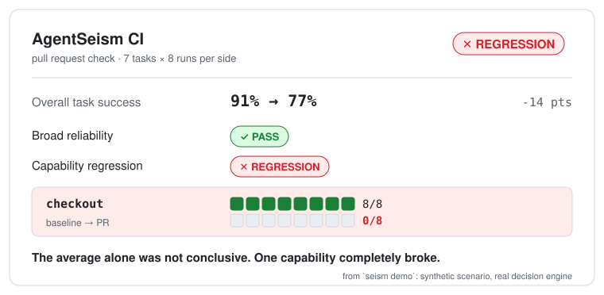
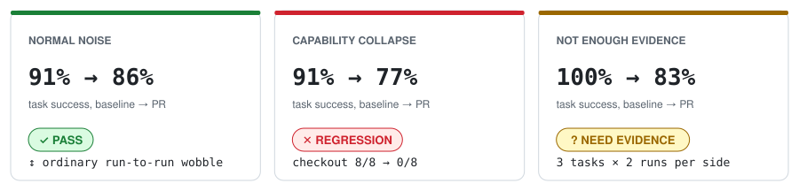
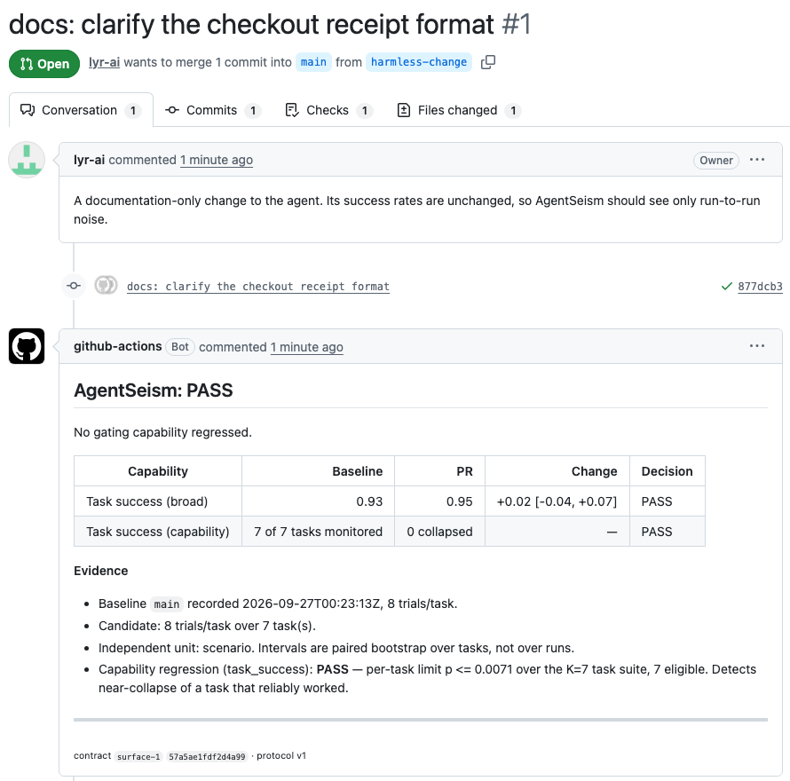
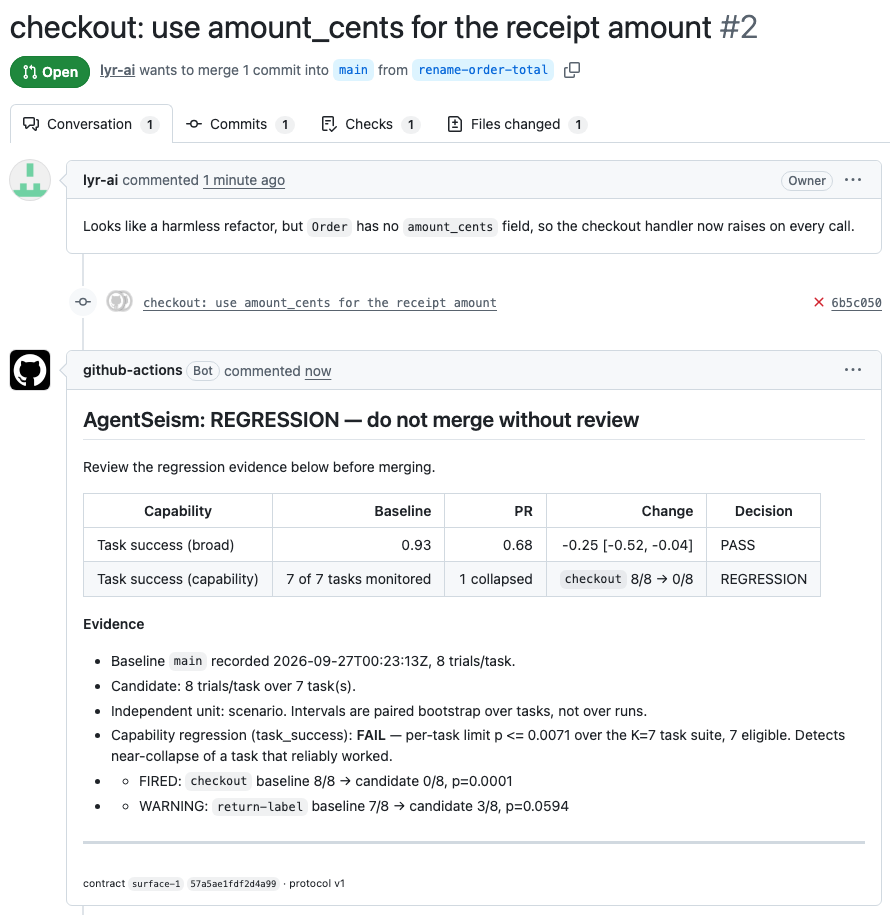

# AgentSeism

**CI for stochastic AI agents.**

Did this PR make your agent worse, or are you just seeing normal run-to-run noise?

<picture>
  <source media="(prefers-color-scheme: dark)" srcset="docs/figures/hero-dark.svg">
  
</picture>

```bash
seism demo      # 1 second, no API key, no Docker, no network
```

> **Fresh real-agent validation.** The rule was frozen first, then tested on tasks it had never seen.
>
> `224 runs` · `7 unseen SWE-bench tasks` · `0 invalid` · `$38.49`
>
> ✓ unchanged agent → **PASS** &nbsp;·&nbsp; ✓ predicted capability collapse → **REGRESSION** &nbsp;·&nbsp; ✓ broad collapse → **REGRESSION**
>
> The scope is narrow: one agent, one model, step-budget regressions only. See [Evidence](#evidence) and [Limitations](#limitations).

**[▶ Try the demo](#quickstart)** · **[Explore a regression](https://lyr-ai.github.io/agentseism/explorer/?s=collapse)** · **[See real PRs](#see-it-on-a-real-pull-request)** · **[Read the evidence](#evidence)** · **[Roadmap](ROADMAP.md)** · **[Discussions](https://github.com/lyr-ai/agentseism/discussions)** · **[Open an issue](https://github.com/lyr-ai/agentseism/issues)**

[Use it on your agent](#use-it-on-your-agent) · [How decisions work](#how-decisions-work) · [Limitations](#limitations)

---

## Why ordinary CI isn't enough

Run the same agent twice and you get different results. A test that expects the
same output every time can't tell a broken PR from a normal wobble. Neither can
a single eval score.

<picture>
  <source media="(prefers-color-scheme: dark)" srcset="docs/figures/cases-dark.svg">
  
</picture>

- **Scores move on their own.** An unchanged agent went from 91% to 86%. That is
  noise, and blocking the PR would be wrong.
- **Averages hide breakage.** 91% to 77% could be noise spread across many
  tasks. Here it is one reliable capability, `checkout`, failing every run.
- **Sometimes there isn't enough data to decide.** 100% to 83% on three tasks run
  twice each is not a pass and not a regression. AgentSeism says so instead of
  guessing.

AgentSeism runs the base branch and the PR several times, keeps each task's
results together, and returns a CI verdict: **PASS**, **REGRESSION**,
**INSUFFICIENT EVIDENCE** or **INCOMPARABLE**.

### Why not just run your eval 5 times?

Repeating an eval gives you more numbers. It doesn't tell you:
- which runs are independent evidence (tasks, not reruns of one task);
- how big a change has to be before it matters;
- how to avoid false alarms when you monitor 50 capabilities at once;
- when you don't yet have enough evidence to decide.

**AgentSeism turns repeated evals into a merge decision.**

The three cases above come from `seism demo`. It uses a simulated agent with
fixed, stated outcomes, and passes them through AgentSeism's real decision
engine. The demo is not evidence; for real-agent results, see [Evidence](#evidence).

## See it on a real pull request

[`lyr-ai/agentseism-example`](https://github.com/lyr-ai/agentseism-example) runs
AgentSeism as a GitHub check on two pull requests. Its agent is simulated (real
handler code, fixed success rates, no API cost). The check, the baseline and the
report are the real product.

| [A docs-only change → **PASS**](https://github.com/lyr-ai/agentseism-example/pull/1) | [A one-line bug in checkout → **REGRESSION**](https://github.com/lyr-ai/agentseism-example/pull/2) |
|---|---|
|  |  |

In the second PR the overall score fell from 0.93 to 0.68 and the broad gate
still passed, because the loss sits in one task. The capability gate caught
`checkout` failing every run.

## Quickstart

Requires **Python 3.11+**. The `python3` that ships with macOS is 3.9, so use
Homebrew, pyenv or uv if you need a newer one.

```bash
git clone https://github.com/lyr-ai/agentseism.git
cd agentseism
python3.11 -m venv .venv && source .venv/bin/activate   # or any Python ≥ 3.11
pip install -e .
seism demo
```

What you'll see:



`seism demo --report` also prints the full markdown report that AgentSeism
posts on a pull request.

## Use it on your agent

You provide two commands: one that runs your agent on a task, and one that
checks the result. AgentSeism handles the repetition, the comparison and the
verdict.

```bash
seism init          # creates .agentseism/contract.yaml and tasks.yaml
```

```yaml
# .agentseism/contract.yaml
runner:     # runs your agent on one task and writes whatever it produced
  command: "{python} run_agent.py --task {task_file} --out {artifact_dir}"

evaluator:  # reads that output and prints one JSON line: {"success": 1} or {"success": 0}
  command: "{python} check_result.py {artifact_dir}"

features:
  task_success:
    gate: true
    regression_threshold: 0.10     # the smallest drop you care about: 10 points
    capability_regression: true    # also block when one reliable task collapses
```

```yaml
# .agentseism/tasks.yaml: one task file per line, in whatever format your runner reads
- tasks/checkout.json
- tasks/refund.json
```

If a run can't be judged (a crash, a timeout, a broken environment), the evaluator
prints `{"invalid": true, "invalid_reason": "..."}`. AgentSeism never counts that
as a failure of your agent.

```bash
# on your main branch: record a baseline once, and commit it
seism baseline --trials 8
git add .agentseism/baselines/main.json

# on a PR branch: rerun and compare
seism check --trials 8
```

`--dry-run` on either command shows what would run and how many agent calls it
would take, without running anything. The capability gate needs 8 runs per task
on each side; with fewer, the report says so rather than guessing.

## GitHub Actions

[`.github/workflows/agentseism.yml`](.github/workflows/agentseism.yml) runs
`seism check` on every pull request, with 8 runs per task by default. It posts
the report as a single comment that updates on each push. Copy it into your
repository, then:

- commit a baseline, because without one the job fails instead of passing on a
  comparison it never made;
- make your agent's API keys available as repository secrets.

The check is green only on **PASS**. **REGRESSION** and **INCOMPARABLE** fail it
(exit 1). **INSUFFICIENT EVIDENCE** fails it too (exit 3), labelled *"AgentSeism
needs more evidence"*: not enough evidence to call a change safe is not a pass,
and it is also not a regression.

## How decisions work

```text
              your PR
                 │
       ┌─────────┴─────────┐
       ▼                   ▼
   baseline            candidate
   N runs/task         N runs/task
       └─────────┬─────────┘
                 ▼
       same environment?  ── no ──▶  INCOMPARABLE
                 │ yes
                 ▼
     enough evidence?  ── no ──▶  INSUFFICIENT EVIDENCE
                 │ yes
                 ▼
   broad drop, or one capability collapsed?
          │ no                  │ yes
          ▼                     ▼
        PASS               REGRESSION
```

| Verdict | Meaning |
|---|---|
| **REGRESSION** | One of two gates fired. The **broad reliability** gate fires when the suite as a whole is confidently worse by at least your threshold. The **capability regression** gate fires when a task that reliably worked in the baseline (at least 7 of 8 runs) collapses in the PR, which with 7 tasks means roughly 2 of 8 runs or fewer. |
| **PASS** | Neither gate found sufficient evidence of a material regression. |
| **INSUFFICIENT EVIDENCE** | Too few tasks or runs to decide. **Not a pass**, and it blocks the merge. |
| **INCOMPARABLE** | Model, runtime or dependencies differ between the two sides. The check stops before running the candidate. |

Two things behind these verdicts matter in practice:

- **Tasks are the unit of evidence.** Running one task 50 times tells you a lot
  about that task and almost nothing about the rest of the suite. The broad gate
  measures uncertainty across tasks, not across runs.
- **Blocking a merge takes strong evidence.** A CI check that fails healthy PRs
  gets ignored. The false-block rate is under about 1–2% in simulation. The
  trade-off is that moderate drops (a task falling from 100% to 75%) are usually
  not blocked, and the capability gate catches *near-collapse*, not every severe
  drop.

The statistics (a paired bootstrap over tasks, and per-task exact tests with a
multiple-comparison correction) are specified in
[`analysis/CI_V1_REGRESSION_SEMANTICS.md`](analysis/CI_V1_REGRESSION_SEMANTICS.md).
Their measured behaviour is in
[`analysis/CI_V1_OPERATING_CHARACTERISTICS.md`](analysis/CI_V1_OPERATING_CHARACTERISTICS.md).

## Evidence

The v1 decision rule was frozen before a fresh, pre-registered study on tasks it
had never seen. That study used 7 SWE-bench Verified tasks, 8 runs per task per
side, and 224 agent runs, with 0 invalid, for $38.49. The agent was
mini-swe-agent with Claude Haiku 4.5.

| Test | Expected | Result |
|---|---|---|
| Unchanged agent (natural noise) | no false block | **PASS** |
| Step budget cut to 40: two tasks predicted in advance to collapse | catch both | **REGRESSION**: both caught |
| Step budget cut to 15: everything collapses | catch it | **REGRESSION** |

For the full protocol, the predictions, every per-task count and what the study
did *not* establish, see
[`analysis/ci_v1/stageC/RESULTS.md`](analysis/ci_v1/stageC/RESULTS.md).

The earlier version of this rule missed a real 40-point regression. That
failure is what led to the capability gate, and it is written up in
[`analysis/CI_V0_RUN_CARD.md`](analysis/CI_V0_RUN_CARD.md).

## Limitations

- **One agent, one model, one kind of regression.** All evidence so far comes
  from mini-swe-agent with Claude Haiku 4.5 on SWE-bench tasks, with regressions
  induced by cutting the step budget. Prompt, tool, model and retrieval
  regressions are untested.
- **Moderate regressions are hard to catch.** By design, the capability gate
  catches near-collapse, and the broad gate needs a clear suite-wide drop.
- **The capability gate hasn't yet shown its value on its own in real data.** In
  the real-agent study the broad gate also fired whenever the capability gate
  did.
- **It isn't cheap yet.** 8 runs per task on both sides is a validation design,
  not an optimised CI budget. Cost and time per PR are open problems.
- **No external users yet.** You would be the first. Issues are welcome.

## Methodology and history

- [`ROADMAP.md`](ROADMAP.md): what's next, and what isn't planned.
- [`docs/EXPERIMENTAL_PRODUCT_DEVELOPMENT.md`](docs/EXPERIMENTAL_PRODUCT_DEVELOPMENT.md): how this project is run.
- [`analysis/`](analysis/): the CI v0 run card, and the v1 design, simulations, simple-baseline comparison and confirmatory study.
- [`research/`](research/README.md): the pre-product research line this grew
  out of (variation localisation, GAIA/OpenRCA pilots, GPU inference). It is
  archived and is not part of the product.

## License

Apache-2.0
