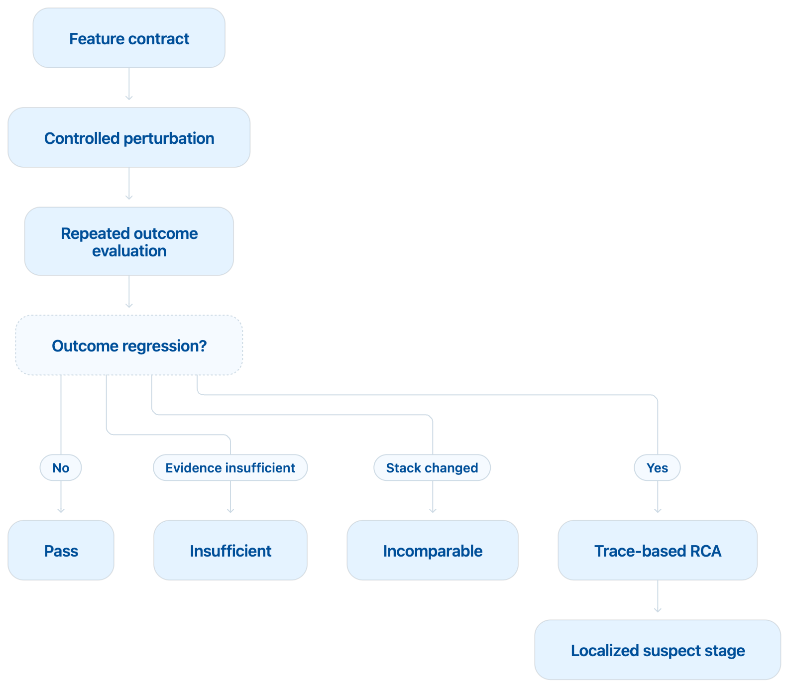

# AgentSeism — feature-driven regression testing

**Status:** product and research positioning, 2026-09-20. Supersedes
`DESIGN-regression-testing-mainline.md` as the entry point. No machine rented.

> **2026-09-20 — the paper framing narrowed after the contribution matrix.**
> The product may stay a full framework; the paper may not be written as one.
> Its centre is the classification of changes — see
> `docs/CONTRIBUTION-MATRIX.md` §6. Features, mutations, the contract and RCA
> are apparatus.

## 1. The positioning

> AgentSeism is a **regression test harness for agent engineering changes**: it
> applies controlled perturbations to capabilities the user has declared
> important, runs the agent repeatedly, measures **outcome** regression, and
> uses traces for root-cause analysis.

Not a score for an agent. Three engineering questions:

1. What capability did this change break?
2. How large is the effect, and is the evidence sufficient?
3. Which component or stage does the regression start at?

## 2. Structure



| Layer | Does | Output |
|---|---|---|
| Feature contract | the user declares N capabilities that matter | `task_completion`, `recovery`, `tool_use`, `long_context` |
| Perturbation suite | a controlled engineering perturbation per capability | timeout, step limit, context pruning, recovery-prompt removal |
| Repeated evaluation | paired or repeated baseline/candidate runs | success rate, cost, latency, intervals |
| Regression decision | does the change matter | `PASS` / `REGRESSION` / `INSUFFICIENT` / `INCOMPARABLE` |
| RCA | trace analysis, **only** for confirmed or suspected regressions | first outcome-relevant divergence, tool failure, recovery failure |
| Report | the CI/PR artifact | which feature degraded, by how much, probable cause |

| Feature | Perturbation | Primary outcome |
|---|---|---|
| long-task completion | lower max steps | resolved rate |
| slow-tool tolerance | shorten tool timeout | tool success, task success |
| malformed-call recovery | remove the recovery prompt, or inject a format error | recovery rate |
| long-context stability | prune earlier | task success, key-fact retention |
| pre-submission verification | drop the "run the tests" requirement | gap between submitted and resolved |
| serving-stack change | change the model/runtime fingerprint | `INCOMPARABLE` — no regression is computed |

## 3. Why this beats choosing trajectory nodes

Node selection answers *what happens to a trajectory if it forks here*.
Feature-driven perturbation answers *which capability the user cares about
degrades when a real engineering knob moves*. Four consequences:

- **Product language.** "Shortening the timeout broke long commands" needs no
  vocabulary lesson.
- **A registered direction.** Which metric should move is written down before
  the run, so the experiment can fail.
- **A defined effect size.** Success-rate difference, recovery-rate difference,
  latency and cost deltas — not a correlation hunted across nodes.
- **An anchored RCA.** Investigation starts at the component the perturbation
  touched, instead of searching every node for association.

**Node-level intervention is not discarded — it is demoted to the RCA
backend.** C2-H's checkpoint continuation becomes the tool that answers *where
did this regression become unrecoverable*, invoked **after** an outcome
regression is confirmed, never as the thing that detects one.

## 4. The boundary with AgentAssay

A mutation suite plus repeated evaluation plus a statistical gate lands back
inside published prior art (`RELATED-WORK-MATRIX.md` §0). The difference has to
be these three, or there is no difference:

**Feature contract, not a mutation score.** The user declares which
capabilities matter, and every perturbation maps to a named capability and a
named outcome. The goal is not how many mutants died.

**Outcomes gate; traces only explain.** A trajectory or fingerprint shift
cannot block a merge. This is where the prior art is weakest and where our own
data speaks: a composite trace detector fires on 6 of 6 pairs of runs that all
resolved the issue (`paper/COMPARABILITY_COUNTEREXAMPLES.md` §1).

**Comparability before regression.** When the model, runtime or scaffold
fingerprint changes, decide whether the two sides are comparable at all.
Gate 9: 0 of 23 fork roots matched with the agent held fixed and only the
serving path moved.

## 5. One structural correction to the flow

In the diagram, *stack changed* is a branch of **Outcome regression?**, so
comparability is decided after the repeated evaluation has run. That inverts
the principle in §4 and costs the whole evaluation budget in the one case where
none of it can be used.

The fingerprint is knowable as soon as both sides are configured, before any
trial. The check belongs there:

```
feature contract
      ↓
controlled perturbation
      ↓
comparability check ──── fingerprint changed ──→ INCOMPARABLE   (no trials run)
      ↓ comparable
repeated outcome evaluation
      ↓
regression? ── no → PASS
             ── thin → INSUFFICIENT
             ── yes → trace RCA → localized suspect stage
```

The saving is not cosmetic: an incomparable comparison detected first costs
zero trials, and detected last costs a full budget. It is also the more honest
order — "we cannot compare these" is a fact about the setup, not a finding
about the agent.

## 6. Reporting: a scorecard, not a number

No `Agent score = 83/100` in the first version. A single number is legible and
hides its weights and its heterogeneity.

| Capability | Baseline | Candidate | Difference | Decision |
|---|---:|---:|---:|---|
| Task completion | 82% | 79% | −3 pp | Insufficient |
| Error recovery | 76% | 48% | −28 pp | **Regression** |
| Long-context retention | 68% | 70% | +2 pp | Pass |
| Cost per resolved task | $0.42 | $0.57 | +36% | Warning |

A weighted release score can come later, as a user-defined view. The
per-capability numbers and their uncertainty stay visible underneath it,
always.

## 7. What is still unproven

Everything above is positioning. It has two counterexamples behind it
(`paper/COMPARABILITY_COUNTEREXAMPLES.md`) and no forward experiment. Before
any of it is claimed:

- the counterexamples rest on **one task** with illustrative thresholds;
- no perturbation has been run, so no expected direction has been tested;
- the RCA backend has never been invoked on a confirmed regression, because
  none has been produced;
- C2-H remains sealed and unrun.

The next step is a minimal design around the weaker of the two
counterexamples — §1, which is six pairs on one task — not a build-out of the
layers above.
